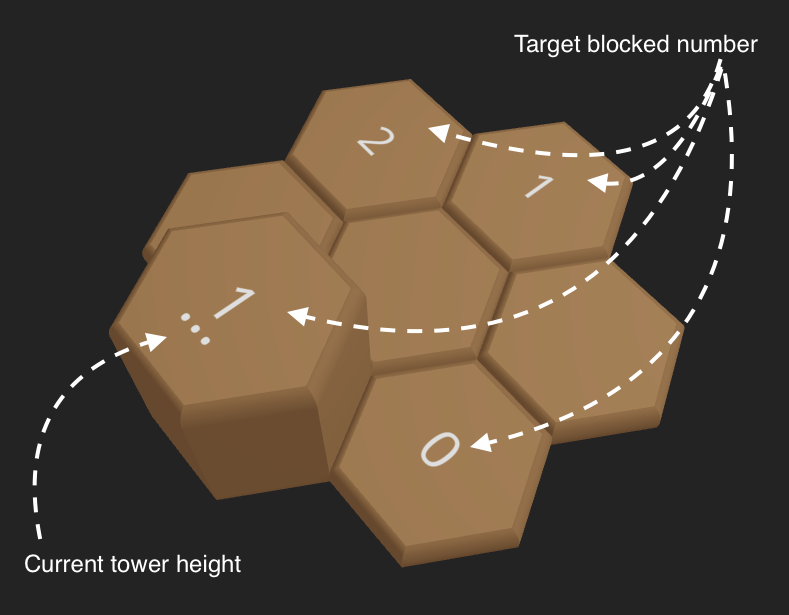
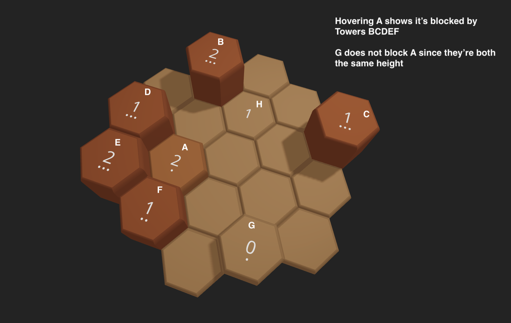
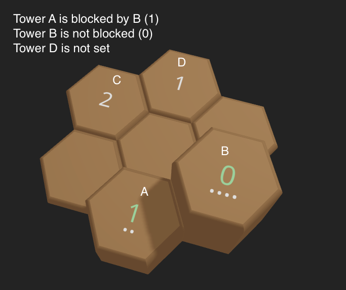
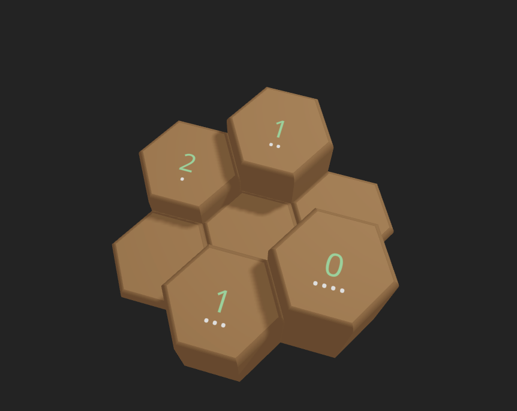

# How to play

## Goal
The goal of the puzzle is to set the heights of all "towers" from 1-4,
such that they're "blocked" on the target number of sides inidcated on the top of the tower.

## Controls

### Camera
Clicking and dragging will allow you to rotate the camera

### Tower Heights
Clicking and right-clicking on a tower will increment and decrement its height respectively.
Allthough towers have a default height of 0, they must be set from 1-4 to complete the puzzle.

## Blocked Directions

A towers blocked target number can range from 0 - 6, as they can be blocked only once on each side. A tower is blocked on a given side if in a given direction, there is a tower taller than itself. Towers of the same height do not count for blocking. 

In the example above, hovering tower A highlights the 5 towers that block it. If we were to hover tower G, it would be blocked by just tower D.

Towers at default (0) height will not show the towers their blocked by, since they haven't been set (and aren't allowed for a solution).

## Winning

When a tower meets its blocked target, (and is not at zero height), its number will turn green.

When all numbers are green the puzzle is solved.

## Level select

Levels are grouped by board size and then tower count. There are board sizes of 2, 3 and 4. For each board size, there are up to 10 levels for each availible tower count. 

Progress is currently not saved when switching between levels.